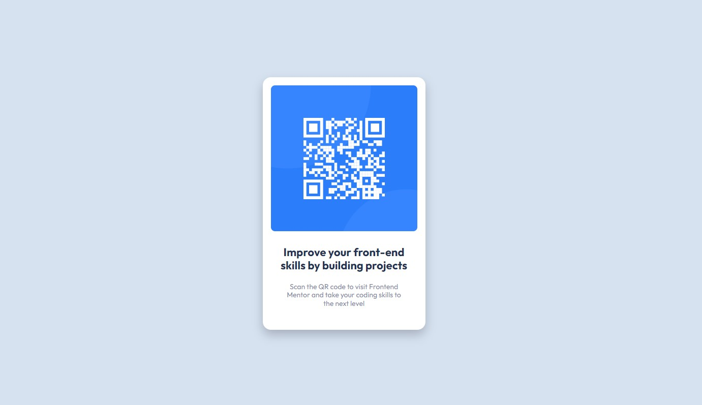

# Frontend Mentor - QR code component solution

This is a solution to the [QR code component challenge on Frontend Mentor](https://www.frontendmentor.io/challenges/qr-code-component-iux_sIO_H). Frontend Mentor challenges help you improve your coding skills by building realistic projects. 

### Screenshot

### Links

- Solution URL: https://www.frontendmentor.io/solutions/qr-code-component-2vfImdOGpA#comment-63d2409be14d81471061576a
- Live Site URL: https://5leepy-qrcode-component.netlify.app/

### Built with

- Semantic HTML5 markup
- CSS custom properties
- SCSS
- Flexbox
- CSS Grid
- Mobile-first workflow
### Useful resources

- https://www.joshwcomeau.com/css/custom-css-reset/ - This helped me to reset my css. I really liked this pattern and will use it going forward.
- https://css-tricks.com/snippets/css/complete-guide-grid/ - This is an amazing article which helped me finally understand CSS Grid. I'd recommend it to anyone still learning this concept.
- https://www.youtube.com/watch?v=jfMHA8SqUL4&t=6s&ab_channel=CoderCoder - I've been looking all over youtube for a tutorial on Sass. Most of them are outdated and still use @import instead of @use and @forward I'm more of a visual learner, even though I read the documentation on the Sass website I still couldn't figure it out but this video is quite clear.

## Author

- Nadir Nahdi
- Frontend Mentor - [@5leepy] https://www.frontendmentor.io/profile/5leepy
- Twitter - [@NadirNahdi] https://twitter.com/NadirNahdi

## Acknowledgments

https://www.youtube.com/@TheCoderCoder 

https://www.youtube.com/@KevinPowell

